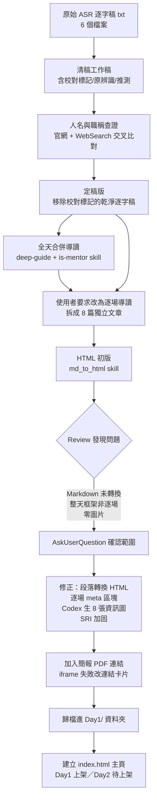

# InfoSec Taiwan 2026 議程筆記專案

## 大會主題與目的

**InfoSec Taiwan 2026 國際資安組織大會**
主題：**The New Trust Boundary｜信任邊界，正在被重新定義**

- 日期：2026-07-07（二）～ 2026-07-08（三）
- 地點：台北喜來登大飯店 B2（台北市中正區忠孝東路一段 12 號）
- 官網：[2026.infosec.org.tw](https://2026.infosec.org.tw/)

AI 正在改變政府治理、企業決策、開發流程、關鍵基礎設施與全球供應鏈的運作方式。當模型開始提供判斷、系統開始自主執行，資安面對的問題不再只是「如何阻擋攻擊」，而是「一個系統是否可信、該由誰驗證、AI 的決策該如何被理解」。大會邀集台灣、日本、新加坡與全球的資安社群、產業與治理領域實務者，圍繞這個提問展開兩天的議程。

InfoSec Taiwan 是少數由社群驅動、非單一廠商主導的國際資安活動，本專案的目的是把兩天的現場逐字稿，整理成可查證、可閱讀、可發布的議程筆記。

---

## 專案結構

```
InfosecTaiwan2026/
├── index.html              # 主頁面，Day1／Day2 導覽入口
├── README.md                # 本檔案
├── 議程/                    # 官方議程手冊（橫跨兩天，通用參考）
└── Day1/                    # 2026-07-07 全部素材與產出
    ├── 1150707infosec-1~6.txt        # 原始 ASR 逐字稿（六個場次錄音檔）
    ├── 1150707_day1_逐字稿.md         # 工作稿（保留校對標記，可追溯異動依據）
    ├── 1150707_day1_逐字稿_定稿.md     # 定稿版（清稿後乾淨可讀版本）
    ├── 1150707_day1_逐字稿_導讀.md     # 全天合併導讀（deep-guide + is-mentor）
    ├── 1150707_day1_導讀_01~08_*.md   # 逐場導讀（八篇，每場獨立成文）
    ├── InfosecTaiwan2026_Day1.html    # Day1 議程導讀網頁成品
    ├── images/                        # AI 生成資訊圖（每場一張，Codex CLI）
    └── 簡報/                          # 講者簡報 PDF
```

---

## 這份筆記是怎麼用 Code Agent 做出來的

本專案全程在 Claude Code（`claude`，本 session 使用模型 Sonnet 5）互動中完成，沒有另外寫程式或人工排版。以下按實際發生順序記錄，包含走過的彎路，供 Day 2 依樣施作時參考。

### 整體流程



### 逐步記錄

**1. 逐字稿清稿（原逐字稿 → 工作稿）**
使用者貼上六段 ASR（語音辨識）自動輸出的逐字稿原始文字，格式是純文字、無標點整理、無發言者標註。依照全域規則裡「原逐字稿輸入」的清稿原則處理：

- 移除語助詞與口吃式重複，保留指示代名詞用法的「這個／那個」
- 依自報姓名、他人稱呼、議程手冊對照，逐句標註發言者
- ASR 明顯誤辨但可高度確認者，逕改為正確詞，並用 `(原辨識:XX)` 附註原文；不確定者用 `(或:XX)`
- 完全無法辨識、或整段轉錄異常（幻覺雜訊，例如背景音樂被誤轉成大段重複文字）的段落，標「（聽不清）」或「（轉錄異常）」，不擅自補寫內容

產出 `1150707_day1_逐字稿.md`，保留完整校對痕跡，作為所有後續版本的事實依據。

**2. 人名與職稱查證**
使用者提供官網連結 `https://2026.infosec.org.tw/`，要求核對逐字稿裡無法確認的人名。實際做法：

- `curl` 抓取官網原始碼（WebFetch 對此網域回傳 403，改用帶瀏覽器 UA 的 `curl` 取得完整 HTML，再用 Python 抽出純文字比對講者名單）
- 官網的講師名單頁面解決了大部分議程講者的姓名拼寫問題
- 開幕式合影名單中幾位資安大聯盟幹部（副理事長、副秘書長、總召集人）官網查不到，改用 `WebSearch` 查證，找到 CIO Taiwan 的大會報導與台灣資安大聯盟成立新聞稿，逐一核實職稱與姓名（過程中修正了自己先前的誤判，例如把 ASR 誤辨的「圖瑞生」和「蔡依朗」分別對應回真正的「涂睿珅」「蔡一郎」）

**3. 定稿版（工作稿 → 乾淨可讀版）**
使用者要求另存一份「辨識後完整」但不含校對標記的版本，供直接閱讀。做法是寫 Python 腳本批次處理，而非手動逐行改寫：

- 第一版規則（含元標記關鍵字的括號整組刪除，其餘括號拆解只留文字）把正常的角色說明括號也拆壞了（例如「蔡一郎（大會主席）」被拆成「蔡一郎大會主席」，語意黏在一起）
- 發現問題後重寫規則：只刪除含校對關鍵字的括號（連括號帶內容整組刪），其餘括號一律原樣保留不動
- 額外處理：移除檔尾「修改說明」整章、簡化「發言者清單」表格只留姓名欄、清掉各場「備註」裡描述轉錄品質的完整句子

產出 `1150707_day1_逐字稿_定稿.md`。

**4. 深度導讀（定稿版 → 敘事文章）**
使用者指定用 **deep-guide**（隱形大師深度導讀）與 **is-mentor**（CyberSensei 資安導師）兩個 skill 建立導讀：

- 用 `Skill` 工具載入這兩個 skill 的方法論到對話中
- deep-guide 提供五段式敘事骨架（痛點先行、靈魂拷問、機制解構、深層真相、落地價值），標題不掛骨架名稱、不出現寫作技法名稱
- is-mentor 提供攻防一體視角：講攻擊手法時同步交代偵測與防禦對策
- 先產出一篇全天合併導讀（`1150707_day1_逐字稿_導讀.md`），接著使用者要求「每一場議程各自建立導讀」，改寫成八篇獨立文章（`1150707_day1_導讀_01~08_*.md`），每篇各自選一個符合該場內容性質的開場鉤子（例如 Joseph Carson 場次用「兩支 AI 互相談判贖金」的真實案例開場）

所有案例、數字、引言都逐一核對回定稿版逐字稿的對應段落，沒有超出逐字稿範圍杜撰內容。

**5. HTML 網頁（八篇導讀 → 可發布網頁）**
使用者指定用 **md_to_html** skill 建立網頁，過程中經歷一次完整的「做壞了 → review → 修正」循環：

- 第一版 HTML（`InfosecTaiwan2026_Day1.html`）建好後，使用者指出「我希望介紹每一場議程（含題目與講者資訊），不是以整天為單位」，並問「html 有生圖嗎」
- 用 Playwright 截圖檢視後發現三個問題：Markdown 原始文字（`#`、`**`）直接貼進 `<div>` 沒有轉換成 HTML 標籤、整天框架而非逐場結構、全文零張圖（視覺呈現是手刻 CSS 卡片與 Mermaid 流程圖，不是 skill 規定的 Codex 生圖）
- 用 `ReportFindings` 記錄三個問題後，用 `AskUserQuestion` 向使用者確認兩個決策點：要生幾張圖（決定每場 1 張，共 8 張）、既有的手刻視覺元件要不要保留（決定保留，與新圖並存）
- 重建：寫 Python 腳本把八篇導讀 md 正確轉成 HTML 段落（避免手動改寫上萬字容易出錯）、每場加上「議程編號／題目／時間／地點／講者」的結構化資訊區塊、用 `codex_imagegen.py` 依序（非平行，避免 codex exec 互相衝突）產生 8 張 16:9 資訊圖，背景執行讓生圖（每張約 1–5 分鐘）不卡住其他工作
- 過程中 hook 提示外部 CDN script（Mermaid.js）缺 SRI（Subresource Integrity）保護，補上：下載腳本計算 `sha384` 雜湊、鎖定明確版本號（而非用 CDN 的 `latest` 別名，避免 CDN 更新後雜湊對不上導致腳本被瀏覽器擋掉）
- 用 `python3 -m html.parser` 驗證語法、Playwright 截圖做桌機／手機 QA，修正手機版 nav 因 logo 文字換行擠壓選單列的排版問題

**6. 講者簡報連結（PDF → 可瀏覽）**
使用者提供第八場（情資交流）講者的簡報 PDF，要求「加上連結而且要可以瀏覽」：

- 第一次嘗試用 `<iframe>` 直接內嵌本機 PDF，Playwright 測試發現請求被 `net::ERR_ABORTED`——這是 Chrome 對本機 `file://` PDF 在 iframe 裡的安全限制（會被判定成下載行為而擋掉），不是路徑編碼錯誤
- 改用可靠做法：一張帶圖示與說明文字的連結卡片，`target="_blank"` 在新分頁開啟，現代瀏覽器對本機 PDF 的原生檢視器都能正常渲染

**7. 歸檔與主頁**
使用者要求建立 `Day1/` 資料夾，把所有跟第一天議程相關的檔案都放進去：

- 逐字稿系列、八篇導讀、HTML、`images/`、簡報 PDF 全部搬入
- 官方議程手冊（橫跨兩天，非單一天的資料）與主題不符的簡報 PDF 屬於邊界案例，用 `AskUserQuestion` 讓使用者拍板去留
- 搬移後用 Playwright 重新載入頁面確認：因為 HTML 與 `images/`、`簡報/` 一起整層搬進 `Day1/`，內部相對路徑不必修改就能繼續運作

接著建立根目錄的 `index.html` 作為大會主頁，內容取自官網「About」段落與議程手冊的日期地點，包含 Day1（可點擊進入）與 Day2（灰階、「待上架」標籤）兩張卡片。

---

## Day 2 施作方式（比照辦理）

Day 2（2026-07-08）要重複同一套流程時，依序執行：

1. **清稿**：貼上 Day 2 原始 ASR 逐字稿，依同樣規則產出工作稿（含校對標記）
2. **查證**：對照官網議程頁與 `WebSearch`，核對講者姓名與職稱
3. **定稿**：寫腳本批次移除校對標記，產出乾淨版逐字稿（`1150707_day2_逐字稿_定稿.md`）
4. **導讀**：載入 deep-guide + is-mentor skill，逐場（而非整天）各寫一篇獨立導讀
5. **建網頁**：載入 md_to_html skill，一次到位做對——每場附題目／時間／地點／講者結構化資訊，每場配一張 Codex 生成資訊圖，外部 CDN 資源加 SRI
6. **簡報連結**：若有講者簡報 PDF，直接採用「連結卡片＋新分頁開啟」，不要嘗試 iframe 內嵌本機 PDF
7. **歸檔**：建立 `Day2/` 資料夾，仿照 `Day1/` 的目錄結構搬入所有相關檔案
8. **更新主頁**：把 `index.html` 裡 Day 2 卡片的 `.disabled` 樣式換成 `.active`，補上 `href="Day2/InfosecTaiwan2026_Day2.html"`，拿掉「待上架」標籤

第 5、6 步是本次唯一走過彎路的地方（Markdown 沒轉換、iframe 內嵌 PDF 失敗），Day 2 可以直接跳過這兩個坑，一次做對。
